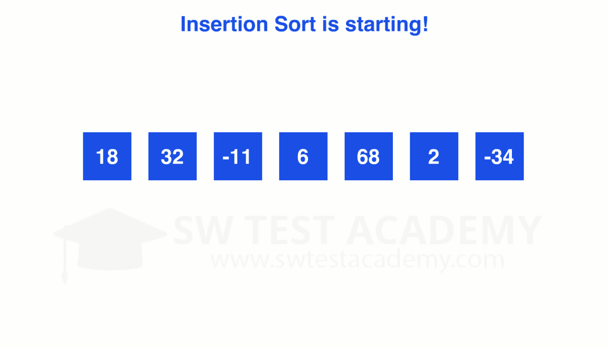

# c_50_insertion_sort

## DESCRIPTION

Insertion sort is a simple sorting algorithm that builds the final sorted array (or list) one item at a time by comparisons. It is much less efficient on large lists than more advanced algorithms such as quicksort, heapsort, or merge sort.

[Insertion sort on Wiki](https://en.wikipedia.org/wiki/Insertion_sort)

